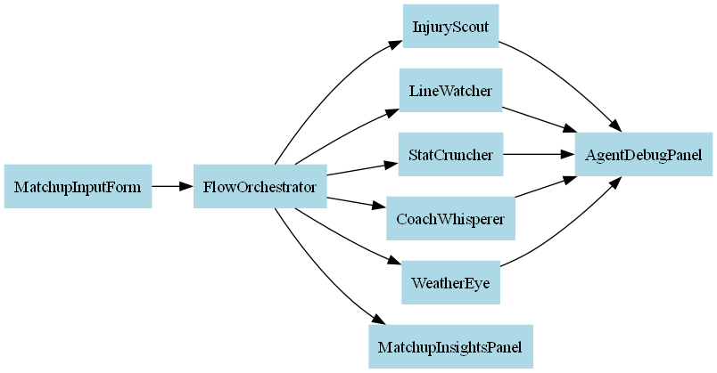

# 🧠 EdgePicks

EdgePicks channels a constellation of AI agents to surface transparent sports insights while advancing planetary health and community well-being.



## Mission
EdgePicks aims to demonstrate how responsible machine intelligence can enhance recreation without sacrificing ethical standards, environmental sustainability, or public health.

## Tech Stack
- **Frontend-ready**: Next.js 14 with TypeScript and Tailwind CSS
- **Modular agents**: plug-in architecture under `lib/agents/`
- **Parallel execution**: Promise-based runner scales horizontally
- **Self-regenerative design**: agents log reflections and can propose upgrades
- **Ancient tech inspiration**: nods to the Antikythera mechanism and other "lost" computation tools

## Feature Highlights
- Live prediction panel with real-time reasoning
- Accuracy leaderboard and dark mode
- 21-track roadmap modules:
  - Parallel Agent Runner
  - Consent Banner
  - Carbon HUD
  - Ancient Tech Gallery
  - Community Impact Dashboard
  - ...and more

## Quick Start
```bash
git clone https://github.com/Csp-Ai/EdgePicks.git
cd EdgePicks
cp .env.local.example .env.local
npm install
npm run dev
```


## Environment
- `npm run setup:dev` creates `.env.local` with safe defaults.
- Or run `cp .env.local.example .env.local` and fill in the values (or `vercel env pull .env.local`).
- In production or on Vercel, env validation is strict and missing vars fail the build.
- CI loads `.env.test` (falling back to `.env.test.example`) for tests and sets `SKIP_BUILD_ENV_CHECK=1` during build unless secrets are configured.
- `.env.example` – base defaults used by various scripts
- `.env.local.example` – template for local development
- `.env.test.example` – template for tests
- In production, set either `NEXT_PUBLIC_SITE_URL` or rely on Vercel's `VERCEL_URL`.
- For canonical URLs and accurate redirects, explicitly set `NEXT_PUBLIC_SITE_URL` to your domain.
- `/api/dev-login` is development-only; in production it returns 404 and skips dev logic.

## Environment Variables

### Production Requirements
- `NEXT_PUBLIC_SITE_URL`: The public site URL.
- `VERCEL_URL`: Fallback URL if `NEXT_PUBLIC_SITE_URL` is not set.

### Notes
- `.env.local` is not generated on Vercel.

## Supabase Client/Server Split
- **Server/Edge Usage**: Use `createServiceClient()` for server-safe operations.
- **Client Usage**: Use `getBrowserClient()` for Realtime operations in the browser.

## Vercel
Set `SPORTS_API_PROVIDER`, `SPORTS_API_KEY`, and `THESPORTSDB_API_VERSION` in both Production and Preview environments.

## Routing Rules
- UI routes live in `app/**`.
- `pages/` is reserved for `pages/api/**` only.
- During build, any conflicting `pages/*.tsx|jsx` is auto-archived to `archive/pages/**`.
- Use `npm run guard:dry` to preview moves locally.

## Testing
```bash
cp .env.test.example .env.test && npm test
```

Tests use MSW; no real SPORTS_API_KEY is required.
Set `ALLOW_TEST_NETWORK=1` to permit live network calls in rare cases.

## Live Demos
- Production: https://edgepicks.app *(placeholder)*
- Staging: https://staging.edgepicks.app *(placeholder)*

## Documentation
- [Agent metadata](agents.ms)
- [LLM orchestration log](llms.txt)
- [AI/ML Constitution](AIML_OVERVIEW.md)

## Contributing
We welcome ethical AI contributions with a sustainability focus. Please read [CONTRIBUTING.md](CONTRIBUTING.md) and review `llms.txt` before opening a pull request.

## Contact & Licensing
- License: [MIT](LICENSE)
- Questions: opensource@edgepicks.app
