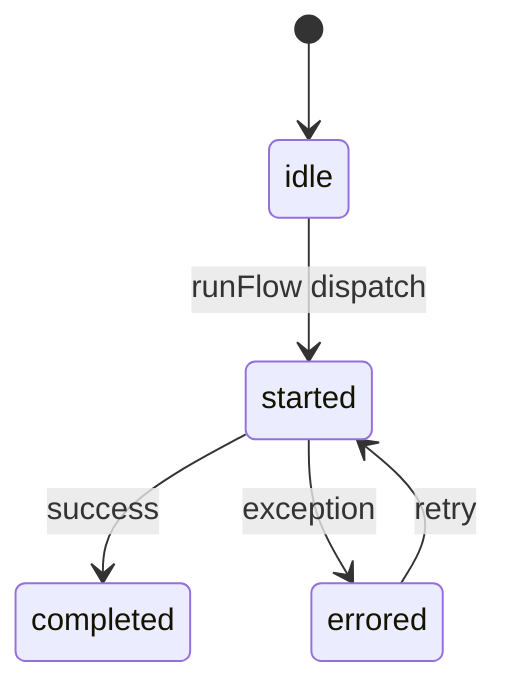

# Agent Lifecycle Overview

## Lifecycle States
- **idle** – default state before `runFlow` begins.
- **started** – emitted when `runFlow` invokes an agent.
- **completed** – agent returns a result without error.
- **errored** – agent throws or rejects.

Within `runFlow`, agents begin in `idle` until the orchestrator fires a `started` event, then transition to `completed` or `errored` based on execution outcome. Reruns re-enter `started` from `errored`.

## Backend Execution
- `/api/run-agents` launches agents for a given session and forwards lifecycle events.
- Each lifecycle event writes to `agentLogsStore` and Supabase via `lifecycleAgent` and `logToSupabase`.
- On completion or error, scores, durations, and stack traces persist alongside `sessionId` and `agentId`.

## Frontend Integration
- `AgentNodeGraph.tsx` animates nodes: pulsing on `started`, dimming on `errored`, and hiding when all agents remain `idle`.
- `AgentStatusPanel.tsx` lists agents with status text, error badges, and **Re-run Agent** buttons for recovery.
- Panels collapse when inactive, providing a fallback when no lifecycle state is active.
- Hovering on a node reveals the agent's latest reflection (`whatIObserved`, `whatIChose`, `whatCouldImprove`) pulled from `logs/agent-reflections.json`.

## Log Emission
- Server‑Sent Events stream `status`, `score`, `error`, and `duration` per agent.
- `AgentLogsModal` fetches logs with these identifiers to display raw output, score breakdown, or error traces.

## Codex & Observability
- `DocSyncAgent` scans lifecycle logs to flag unsynced or abnormal sessions for documentation.
- Clear states help Codex target prompts, debug failures, and auto‑generate docs.

## Testing
- `runAgentsApi.test.ts` verifies streaming and summary logging for lifecycle events.
- After each run, status changes appear in logs and UI, confirming state propagation.

---
**Summary**
- Timestamp: 2025-08-07T10:42:11Z
- File: agent-lifecycle-overview.md
- Lifecycle states referenced: 4
